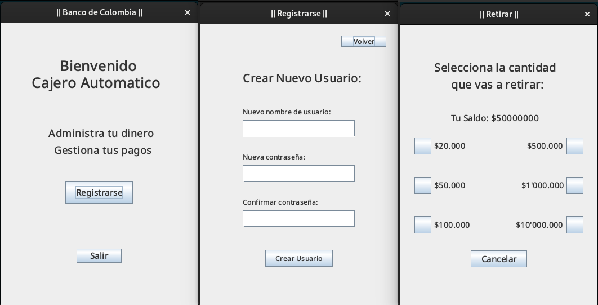
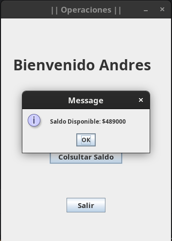
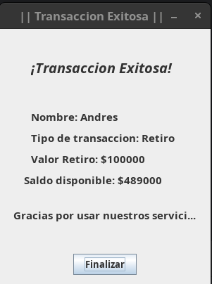

# Simulador Sistema Bancario

## Descripción:
Este proyecto es un simulador de cajero automático desarrollado
en Java, aplicando Programación Orientada a Objetos y utilizando
Java Swing para la creación de interfaces gráficas.

El simulador incluye funciones como registro de usuario, inicio
de sesión, consulta de saldo, depósito y retiro de dinero. Además,
simula la autenticación de datos antes de cada transacción y, al
finalizar cada operación, genera la factura correspondiente.
 

- Consulta de saldo:

- Factura generada:

  
    
## Objetivos del proyecto:
1. Poner en practica los conocimientos adquiridos en los cursos que tome sobre
programación orientada a objetos con Java:
    
    - Abstracción.
    - Herencia.
    - Encapsulamiento.
    - Polimorfismo.
    - Clases y Objetos.
    - Clases abstractas e interfaces.
    - Principio de modularidad.
    - Constructores.
    - Variables y métodos estáticos.
    - Sobre escritura de métodos.
    - Getters y Setters.
    - Palabras reservadas de Java.
    - Funcionamiento de la memoria en Java(Stack, Heap).
    - Garbage Collector.
    - Manejo de errores.
    - Entre otros...
       
2. Mejorar mi lógica de programación.

## ¿Como usar el programa?
1. Descarga los archivos en tu equipo.

#### Para ejecutarlo utilizando un IDE:
Abre la carpeta desde tu IDE preferido y corre el programa directamente
desde la clase Main.

### Para ejecutarlo sin utilizar un IDE:
1. Descarga el archivo CajeroAutomatico.jar
2. Ejecuta el .jar de acuerdo a tu SO.
 
Ya puedes hacer uso del programa :).
 
Nota: Recuerda tener instalado JDK 21.0.4 en tu equipo.
